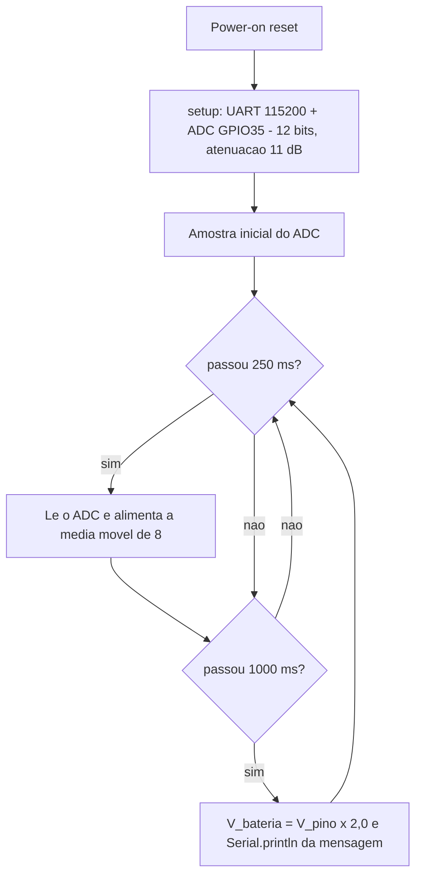

# design.md — Monitor de Tensão de Bateria (ESP32 / LOLIN32 Lite)

## 1. Alvo e toolchain

| Item | Valor |
|---|---|
| Board ID PlatformIO | `lolin32_lite` (WEMOS LOLIN32 Lite) |
| Platform | `espressif32@6.9.0` (fixado) |
| Framework | Arduino (`framework-arduinoespressif32` 3.20017.241212+sha.dcc1105b = Arduino-ESP32 2.0.17) |
| Toolchain | `toolchain-xtensa-esp32` |
| Ambientes | `lolin32_lite` (alvo, default) e `native` (testes HOST) |

## 2. Interface do ADC

| Atributo | Valor | Observação |
|---|---|---|
| Pino | GPIO 35 (`AO35` / `GPO 35`) | ADC1_CH7; **entrada pura** — sem pull-up/pull-down |
| `pinMode` | `INPUT` | |
| Resolução | 12 bits → 0..4095 | `analogReadResolution(12)` |
| Atenuação | `ADC_11db` | faixa útil ≈ 0..3,1 V no pino |
| Tensão esperada no pino | 0 .. ≈2,1 V (bateria 1S ÷ 2) | dentro da faixa linear recomendada (~150–2 450 mV a 11 dB) |
| Faixa legal do memorial | divisor 0,5 → bateria até ≈4,2 V | acima de 4,2 V a proteção é elétrica, não de firmware |
| Escala de conversão | `V_bateria = V_pino × 2,0` | fator exato do divisor 47 kΩ / 47 kΩ (FR-002) |
| Cadência | amostra 250 ms · relatório 1 000 ms | não fixado no memorial (P-3) |

## 3. Diagrama de fluxo



## 4. Estrutura de arquivos

```text
firmware/
├── platformio.ini                 # envs: lolin32_lite (alvo, default) e native (HOST)
├── src/
│   ├── config.h                   # pinos, atenuação, cadência, tamanho de buffer
│   └── main.cpp                   # HAL/BSP: ADC, UART, agendamento com millis()
├── lib/battery_logic/             # LÓGICA PURA — não inclui Arduino.h
│   ├── library.json
│   └── src/
│       ├── battery_logic.h
│       └── battery_logic.cpp
└── test/test_battery_logic/
    └── test_main.cpp              # 12 testes Unity (env native)
```

A separação HAL × lógica pura é o que permite testar a matemática e o formato da
mensagem em HOST, sem hardware (`AGENTS.md` §6; instruction
`01-embedded-engineering`).

## 5. Contratos internos

```cpp
namespace battery {
constexpr float kDividerScaleFactor = 2.0f;   // FR-002
constexpr std::size_t kAveragingWindow = 8;   // NFR-002

float batteryVolts(std::int32_t pinMilliVolts);            // satura negativos em 0
class MilliVoltAverager { void reset(); void add(...); std::int32_t averageMilliVolts() const; std::size_t count() const; };
int formatBatteryMessage(float volts, char* out, std::size_t outSize);  // -1 se buffer insuficiente
}
```

- `MilliVoltAverager`: buffer circular estático; média das amostras já
  coletadas enquanto a janela não estiver cheia; a 9ª amostra descarta a mais
  antiga.
- `formatBatteryMessage`: usa `snprintf` com `"Tensão da Bateria: %.2f V"`;
  retorna o número de caracteres gravados ou `-1` (buffer nulo/insuficiente,
  truncando com `'\0'`).

## 6. Decisões arquiteturais

### ADR-001 — Alvo é ESP32 (LOLIN32 Lite), não o ESP8266 de `AGENTS.md` §5

- **Contexto:** o memorial (`docs/memorial.txt`) exige GPIO 35 como ADC — pino
  que só existe no ESP32 (ADC1_CH7, entrada pura). `AGENTS.md` §5 descreve o
  projeto térmico ESP8266 (NodeMCU v2).
- **Decisão:** o memorial é a fonte de verdade desta tarefa; o alvo é
  `lolin32_lite` (ESP32 + framework Arduino).
- **Consequências:** as proibições de `AGENTS.md` §5 (GPIO16 sem PWM, timers,
  `delay()`) não são restrições deste firmware, embora o estilo não bloqueante
  tenha sido mantido por NFR-003. Registrado como `SPEC_DEVIATION-001` em
  `spec.md`.

### ADR-002 — Conversão ADC→tensão pela rotina calibrada do core

- **Contexto:** o memorial pede "converter o valor bruto do ADC para volts". O
  caminho alternativo seria `V = raw / 4095 × Vref`, assumindo `Vref` = 3,3 V.
  O ADC do ESP32 tem `Vref` real dependente do chip, e a instruction
  `01-embedded-engineering` proíbe inventar níveis elétricos do MCU.
- **Decisão:** usar `analogReadMilliVolts()`, que aplica a calibração por eFuse
  do core, e então aplicar o fator 2,0 do divisor na lógica pura.
- **Consequências:** não há constante de `Vref` no código. O valor bruto não é
  exposto; se for necessário no futuro, `analogRead()` pode ser adicionado sem
  alterar a lógica pura (que recebe mV).
- **A CONFIRMAR:** comparar a leitura com multímetro na bancada (R-1, P-5).

### ADR-003 — Média móvel de 8 amostras

- **Contexto:** NFR-002 exige minimizar flutuações; o ESP32 ADC é ruidoso.
- **Decisão:** média móvel de 8 amostras a 4 Hz (janela de 2 s) na lógica pura,
  buffer estático, sem alocação dinâmica.
- **Consequências:** o primeiro relatório (t = 1 s) usa média parcial (4
  amostras). Não é `SPEC_DEVIATION`: o fator 2,0 e o formato da mensagem
  permanecem exatamente os especificados.

### ADR-004 — Saída serial contém apenas a mensagem contratada

- **Contexto:** o memorial §4.1 enfatiza que ferramentas automatizadas devem
  interpretar a saída "sem erros de parsing".
- **Decisão:** não imprimir banner de boot nem linhas de diagnóstico. O monitor
  serial emite **somente** linhas `Tensão da Bateria: X.XX V`.
- **Consequências:** o stream é trivialmente parseável (uma regex por linha).
  Se um banner for desejado, deve ser reavaliado como mudança de contrato.

## 7. Rastreabilidade de código

| Requisito | Arquivo / símbolo |
|---|---|
| FR-001 | `src/config.h` (`kAdcPin`, `kAdcResolutionBits`, `kAdcAttenuation`), `src/main.cpp` (`setup`) |
| FR-002 | `lib/battery_logic/src/battery_logic.cpp` (`batteryVolts`, `kDividerScaleFactor`) |
| FR-003 | `lib/battery_logic/src/battery_logic.cpp` (`formatBatteryMessage`), `src/main.cpp` (`reportVoltage`) |
| NFR-002 | `lib/battery_logic/src/battery_logic.cpp` (`MilliVoltAverager`) |
| NFR-003 | `src/main.cpp` (`setup`, `loop`) |
