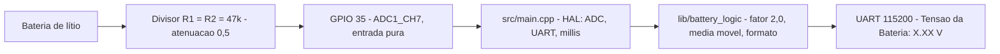

# Monitor de Tensão de Bateria — ESP32 (WEMOS LOLIN32 Lite)

Firmware que mede a tensão de uma bateria de lítio por um **divisor de tensão**
ligado ao **GPIO 35** do ESP32 e transmite o valor no monitor serial em formato
fixo, para avaliação técnica de bancada.

- **Especificação (fonte de verdade):** [`docs/memorial.txt`](docs/memorial.txt)
- **Requisitos / critérios de aceite:** [`.specs/features/battery-monitor/spec.md`](.specs/features/battery-monitor/spec.md)
- **Decisões técnicas (ADR):** [`.specs/features/battery-monitor/design.md`](.specs/features/battery-monitor/design.md)
- **Estado atual:** [`STATUS.md`](STATUS.md) · **Evidências:** [`docs/05-testing/evidence-battery-monitor.md`](docs/05-testing/evidence-battery-monitor.md)

## Saída produzida

Uma linha por segundo, exatamente neste formato (duas casas decimais, espaço
simples, `V` maiúsculo):

```text
Tensão da Bateria: 4.20 V
```

O firmware **não** imprime banner nem diagnóstico: o stream é trivialmente
parseável (ADR-004).

## Hardware

| Elemento | Especificação |
|---|---|
| Placa | WEMOS LOLIN32 Lite (ESP32-D0WDQ6, 4 MB flash) — **A CONFIRMAR** o modelo comercial exato |
| Pino de medição | **GPIO 35** (`AO35` / `GPO 35`) — ADC1_CH7, **entrada pura**, sem pull-up/pull-down |
| R1 (superior) | 47 kΩ |
| R2 (inferior) | 47 kΩ |
| Razão do divisor | 0,5 → `V_bateria = V_pino × 2,0` |
| ADC | 12 bits, atenuação 11 dB |
| UART | 115 200 baud, 8N1 |



> O memorial identifica o pino também pelos aliases `AO35` e `GPO 35`.

### Fora de escopo

Sleep/baixo consumo, Wi-Fi/BLE, armazenamento não volátil, gerenciamento de
carga, atuadores e display (memorial §1.2).

## Estrutura de diretórios

```text
firmware/                        # Projeto PlatformIO
├── platformio.ini               # envs: lolin32_lite (alvo, default) e native (HOST)
├── src/
│   ├── config.h                 # pino, atenuação, cadência, buffer
│   └── main.cpp                 # HAL/BSP: ADC, UART, loop com millis()
├── lib/battery_logic/           # lógica pura (não inclui Arduino.h)
│   └── src/{battery_logic.h,.cpp}
├── test/test_battery_logic/     # 12 testes Unity
└── scripts/hil_serial_check.py  # verificador HIL do contrato serial
.specs/                          # artefatos SDD (constituição, spec, design, tasks)
docs/                            # memorial, protocolo agêntico, evidências
```

## Pré-requisitos

- **PlatformIO Core** com a plataforma `espressif32@6.9.0` (fixada em `platformio.ini`).
- Neste ambiente o `pio` do `PATH` está quebrado (venv pipx com *symlink* inválido),
  então use o módulo Python:

```bash
export PYTHONPATH="$HOME/.local/share/pipx/venvs/platformio/lib/python3.12/site-packages"
PY=$(command -v python3)
```

## Comandos

| Ação | Comando |
|---|---|
| Compilar para o alvo | `$PY -m platformio run -d firmware -e lolin32_lite` |
| Testes HOST (lógica pura) | `$PY -m platformio test -d firmware -e native` |
| Gravar no ESP32 | `$PY -m platformio run -d firmware -e lolin32_lite -t upload --upload-port /dev/ttyUSB0` |
| Monitor serial | `$PY -m platformio device monitor -d firmware -p /dev/ttyUSB0 -b 115200` |
| Identificar o chip | `$PY ~/.platformio/packages/tool-esptoolpy/esptool.py --port /dev/ttyUSB0 flash_id` |

## Verificação

### HOST — lógica pura (obrigatório)

```bash
$PY -m platformio test -d firmware -e native
```

Cobre o fator de escala 2,0 (CA-002) e a formatação exata da mensagem (CA-003)
sem hardware.

### HIL — contrato serial no alvo

```bash
$PY firmware/scripts/hil_serial_check.py --port /dev/ttyUSB0 --seconds 60
```

O verificador lê o monitor por N segundos e reporta: linhas conformes, linhas
fora do contrato, min/max/média em volts, variação pico-a-pico e o intervalo
entre linhas. Sai com código 0 (PASS) ou 1 (FAIL).

### HIL — fator 2,0 com tensão conhecida (pendente)

Ainda **não realizado**: nenhuma tensão está aplicada ao divisor. Para fechar
CA-002 no hardware:

1. Aplique uma tensão estável e conhecida na entrada do divisor (topo de R1) —
   por exemplo 3,00 V de uma fonte de bancada.
2. Meça a mesma tensão com multímetro e registre o valor.
3. Rode o verificador HIL e compare a média reportada com a referência.
   Esperado: leitura ≈ referência (tolerância a definir; o ADC do ESP32 com
   11 dB tem exatidão limitada fora da faixa ~150–2 450 mV).
4. Registre o resultado em `docs/05-testing/`.

## Limitações conhecidas

- **O firmware não detecta sensor/bateria ausente.** Com o pino flutuante ele
  reporta ~0,28 V como se fosse medida. O memorial não exige essa detecção
  (fora de escopo).
- A exatidão absoluta depende do ADC do ESP32 (não linear nas extremidades da
  faixa). A conversão usa a calibração por eFuse do core (ADR-002) em vez de um
  `Vref` assumido.
- Baud, período de amostragem (250 ms) e de relatório (1000 ms) **não** estão
  fixados no memorial; são escolhas registradas (P-2/P-3 em `spec.md`).

## Governança do repositório

Este repositório segue o fluxo SDD descrito em [`AGENTS.md`](AGENTS.md) e
[`docs/agentic/`](docs/agentic/). Leia `AGENTS.md` antes de alterar código.

> **Atenção:** `AGENTS.md` §5 descreve as restrições de hardware do *projeto
> térmico ESP8266 (NodeMCU v2)*, que **não** se aplica a este firmware ESP32.
> O conflito está registrado como `SPEC_DEVIATION-001` em
> [`.specs/features/battery-monitor/spec.md`](.specs/features/battery-monitor/spec.md)
> e depende de decisão do responsável.

## Licença

Apache License 2.0 — Copyright 2026 William.
Detalhes em <http://www.apache.org/licenses/LICENSE-2.0>.
