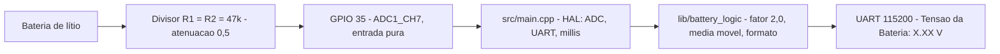

<!-- prettier-ignore -->
<div align="center">

# Monitor de Tensão de Bateria

[](LICENSE)
[](https://platformio.org)
[](#hardware)
[](https://www.arduino.cc)

Firmware ESP32 que mede a tensão de uma bateria de lítio através de um divisor de
tensão e publica o resultado no monitor serial.

[Hardware](#hardware) · [Primeiros passos](#primeiros-passos) · [Comandos](#comandos) · [Verificação](#verificação) · [Limitações](#limitações)

</div>

O firmware lê o pino **GPIO 35** a 12 bits e reporta uma linha por segundo:

```text
Tensão da Bateria: 4.20 V
```

> [!IMPORTANT]
> O texto acima é um **contrato de interface**: duas casas decimais, um espaço
> simples e `V` maiúsculo. O firmware não imprime banner nem diagnóstico, então
> uma única regex por linha basta para validar a saída automaticamente.

A documentação de engenharia vive em `.specs/` e é a fonte de verdade do
comportamento: [spec](.specs/features/battery-monitor/spec.md) ·
[design/ADRs](.specs/features/battery-monitor/design.md) ·
[tarefas](.specs/features/battery-monitor/tasks.md) ·
[evidências](docs/05-testing/evidence-battery-monitor.md) ·
[estado](STATUS.md).

## Hardware

| Elemento | Especificação |
|---|---|
| Placa | WEMOS LOLIN32 Lite — ESP32-D0WDQ6, 4 MB flash |
| Pino de medição | **GPIO 35** (`AO35` / `GPO 35`) — ADC1_CH7, entrada pura, sem pull-up/pull-down |
| R1 (superior) | 47 kΩ |
| R2 (inferior) | 47 kΩ |
| Razão do divisor | 0,5 → `V_bateria = V_pino × 2,0` |
| ADC | 12 bits, atenuação 11 dB |
| UART | 115 200 baud, 8N1 |



> [!WARNING]
> **Nunca ligue a bateria diretamente no GPIO 35.** O pino tolera ~3,3 V e o
> divisor de 47 kΩ/47 kΩ é a única proteção contra sobretensão. Sem o divisor, a
> bateria de lítio danifica o ESP32.

Fora de escopo: sleep/baixo consumo, Wi-Fi/BLE, armazenamento não volátil,
gerenciamento de carga, atuadores e display (memorial §1.2).

## Primeiros passos

### Estrutura do projeto

```text
firmware/                        # Projeto PlatformIO
├── platformio.ini               # envs: lolin32_lite (alvo, default) e native (HOST)
├── src/
│   ├── config.h                 # pino, atenuação, cadência, buffer
│   └── main.cpp                 # HAL/BSP: ADC, UART, loop com millis()
├── lib/battery_logic/           # lógica pura (não inclui Arduino.h)
│   └── src/{battery_logic.h,.cpp}
├── test/test_battery_logic/     # 12 testes Unity
└── scripts/hil_serial_check.py  # verificador HIL do contrato serial
.specs/                          # artefatos SDD (constituição, spec, design, tasks)
docs/                            # memorial, protocolo agêntico, evidências
```

A separação entre `lib/battery_logic/` (lógica pura) e `src/` (HAL) é o que
permite testar cálculo e formatação em HOST, sem hardware.

### Pré-requisitos

- **PlatformIO Core** com a plataforma `espressif32@6.9.0` (fixada em `platformio.ini`).
- Placa ESP32 conectada por USB (`/dev/ttyUSB0` nos exemplos).

> [!WARNING]
> Neste host o `pio` do `PATH` está quebrado (venv pipx com *symlink*
> inválido). Invoque o PlatformIO como módulo Python:

```bash
export PYTHONPATH="$HOME/.local/share/pipx/venvs/platformio/lib/python3.12/site-packages"
PY=$(command -v python3)
```

## Comandos

| Ação | Comando |
|---|---|
| Compilar para o alvo | `$PY -m platformio run -d firmware -e lolin32_lite` |
| Testes HOST (lógica pura) | `$PY -m platformio test -d firmware -e native` |
| Gravar no ESP32 | `$PY -m platformio run -d firmware -e lolin32_lite -t upload --upload-port /dev/ttyUSB0` |
| Monitor serial | `$PY -m platformio device monitor -d firmware -p /dev/ttyUSB0 -b 115200` |
| Identificar o chip | `$PY ~/.platformio/packages/tool-esptoolpy/esptool.py --port /dev/ttyUSB0 flash_id` |
| Verificação HIL | `$PY firmware/scripts/hil_serial_check.py --port /dev/ttyUSB0 --seconds 60` |

## Verificação

Resultado da última execução (2026-10-09, ESP32 físico em `/dev/ttyUSB0`):

| Verificação | Resultado |
|---|---|
| Testes HOST | 12/12 PASSED |
| Build do alvo | 0 erros, 0 warnings · flash 21,1 % · RAM 6,6 % |
| Contrato serial (HIL) | 72/72 linhas conformes, 1 linha/s |
| Estabilidade (HIL, 60 s) | PASS — 60 linhas, jitter ≤ 1 ms, sem reinício |

O chip foi identificado como **ESP32-D0WDQ6 rev v1.1** (4 MB, *VRef calibration
in eFuse*). A evidência completa está em
[`docs/05-testing/evidence-battery-monitor.md`](docs/05-testing/evidence-battery-monitor.md).

### HOST — lógica pura

```bash
$PY -m platformio test -d firmware -e native
```

Cobre o fator de escala 2,0 e a formatação exata da mensagem, sem hardware.

### HIL — contrato serial no alvo

O verificador lê o monitor por N segundos e reporta linhas conformes, linhas fora
do contrato, min/max/média em volts, variação pico-a-pico e o intervalo entre
linhas. Código de saída `0` = PASS, `1` = FAIL.

<details>
<summary><b>Validar o fator 2,0 com tensão conhecida (pendente)</b></summary>

Ainda **não realizado**: nenhuma tensão está aplicada ao divisor.

1. Aplique uma tensão estável e conhecida na entrada do divisor (topo de R1) —
   por exemplo 3,00 V de uma fonte de bancada.
2. Meça a mesma tensão com multímetro e registre o valor.
3. Rode o verificador HIL e compare a média reportada com a referência.
4. Registre o resultado em `docs/05-testing/`.

O ADC do ESP32 com 11 dB tem exatidão limitada fora da faixa ~150–2 450 mV; o
alvo de 2,1 V no pino fica dentro dela.

</details>

## Limitações

- **Sem detecção de sensor ausente.** Com o pino flutuante o firmware reporta
  ~0,28 V como se fosse medida — o memorial não exige essa detecção.
- **Exatidão do ADC.** A conversão usa a calibração por eFuse do core
  (`analogReadMilliVolts`) em vez de um `Vref` assumido; o ADC do ESP32, no
  entanto, não é linear nas extremidades da faixa.
- **Parâmetros não fixados na especificação.** Baud 115 200, amostragem 250 ms e
  relatório 1000 ms são escolhas registradas (`P-2`/`P-3` em `spec.md`).

## Desenvolvimento

Este repositório segue o fluxo SDD descrito em [`AGENTS.md`](AGENTS.md) e
[`docs/agentic/`](docs/agentic/). Leia `AGENTS.md` antes de alterar código.

> [!CAUTION]
> `AGENTS.md` §5 ainda descreve as restrições de hardware do *projeto térmico
> ESP8266 (NodeMCU v2)*, que **não** se aplica a este firmware ESP32. O conflito
> está registrado como `SPEC_DEVIATION-001` em
> [`.specs/features/battery-monitor/spec.md`](.specs/features/battery-monitor/spec.md)
> e aguarda decisão do responsável.

---

MIT · Copyright (c) 2026 William — veja [`LICENSE`](LICENSE) ·
<https://opensource.org/license/mit>
